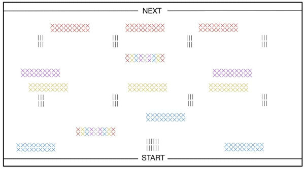
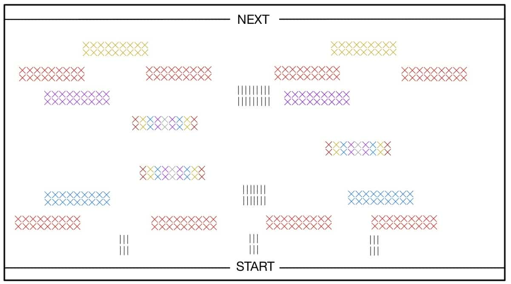
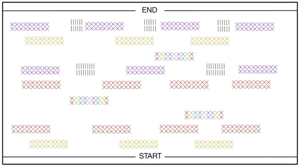

# Jumping Frog Game in C

This is a Jumping Frog Game written in C using the ncurses library, developed as part of the Basics of Computer Programming course in my third semester at Gdańsk University of Technology.

## Author
- Karolina Glaza [GitHub](https://github.com/kequel)

Project made using demo game Catch the Ball from dr hab. inż. Michał Małafiejski

### Version
- Current version: **1.0**

## Description
Jumping Frog is an action game where the player controls a frog to navigate a road filled with moving cars, static obstacles, and a predatory stork. The goal is to reach the destination (top of the screen) without colliding with cars or being caught by the stork.
Game include ranking with TOP 3 players (fastest to complete all 3 levels).

## Levels 
level 1:

level 2:

level 3:

## Game Components

### FROG

Moves vertically or horizontally with the W-A-S-D keys. The frog can also call for friendly taxis using the T key, although the taxi must be in front of him. Frog has 3 lives and 200s for each level.

### STATIC OBSTACLES

Limit movment of frog and cars.

### STORK

Hunts the frog with dynamic movement. Kills frog instantly.

## Cars:

Cars can have diffrent speeds, accelerations, colors and properties. They always stay on the same line.

### RED CAR 

Wrapping, agressive (won't help the frog) car - disappears when reaching the border and apears on the other side. 

### PURPLE CAR 

Bouncing, agressive car - bounces when reaching the border.

### YELLOW CAR  

Wrapping, friendly, taxi car, can take frog to diffrent place, although can also kill.

### BLUE CAR 

Bouncing, friendly, stopping car - stops when sees the frog, although can kill it if frog marches into it.

### RANDOM CAR 

Has random speed, acceleration and type, can even not appear at all.

## Controls

W: Jump upward

A: Jump left

S: Jump downward

D: Jump right

T: Call for taxi

Q: Quit the game

X: Save the game

C: Continue from a saved game

## Configuration
Game parameters like frog size, car types, speeds, and level settings are defined in external configuration files, which allows easy customization.

